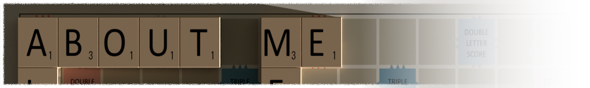
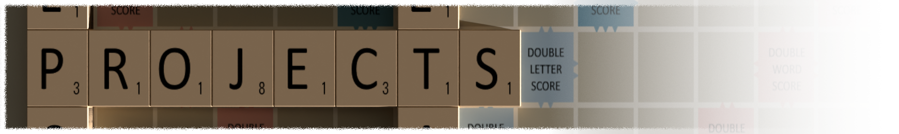
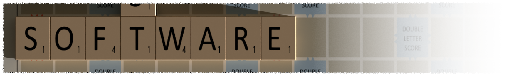

   

<!-- Using LaTeX equation syntax to make a colored heading. -->
$$
\color{#BC0064}
\LARGE
\text{Hello and welcome to my profile}
$$

*I will mostly post work that I have finished and am happy with, but I might post a work in progress on certain occasions.*

*I want to focus on 3D stuff and things related to Blender, however Blender is only part of my workflow check below to see all the software that I use, and how...*

I use the following software for all my work.

|  |  |  |
|-----------------------------|---------------------------------|---------------------------------|
| Addons:                       | Plugins:                          | Packages:                          |
| [Node Arrange](https://github.com/Leonardo-Pike-Excell/node-arrange) | [BoltBait Plugin Pack](https://boltbait.com/pdn/) | [PowerShell Package](https://github.com/SublimeText/PowerShell) |
| [Ucupaint](https://github.com/ucupumar/ucupaint) | [DPY Plugin Pack](https://forums.paint.net/topic/16643-dpys-plugin-pack-2014-05-04/) | |

If you want the .blend file I used in my headings, you can get it [here](https://raw.githubusercontent.com/johannL1995/johannL1995/refs/heads/main/Scrabble.blend) (The collection has all the letters in it, just unhide it by pressing H)
